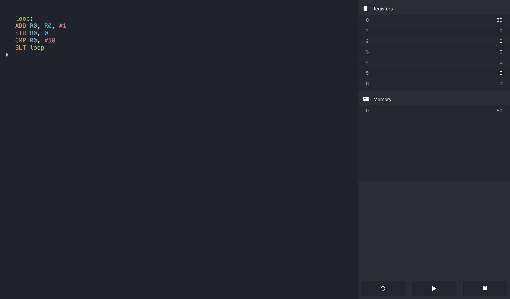

# AQA Assembly Editor & Interpreter

**A React based interpreter for the fictional assembly language used in A-level papers with syntax highlighting**



## Use it online now

I recommend reading the spec linked below before playing around

http://overflo.me/aqa

## What is AQA assembly?

AQA Assembly is an assembly syntax written for A-level Computer Science papers. This interpreter allows you to practise writing working AQA assembly at home/while revising, instead of winging it in the exam. A description of the syntax and instruction set is available [here](https://filestore.aqa.org.uk/resources/computing/AQA-75162-75172-ALI.PDF)

## Run it yourself

```bash
git clone https://github.com/adamsoutar/aqa-assembly
cd aqa-assembly
npm i && npm start
```

## The stack

Everything is run in the frontend. There are no dependencies besides styled-components, Font Awesome and those included with create-react-app. Everything is in the source, even down to my home-made syntax highlighting solution.
